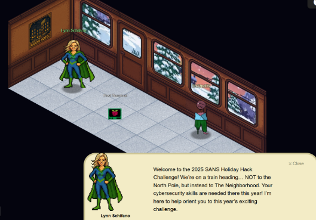
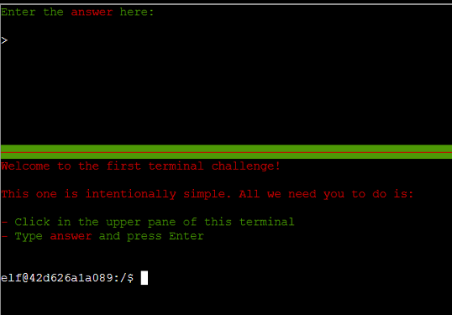
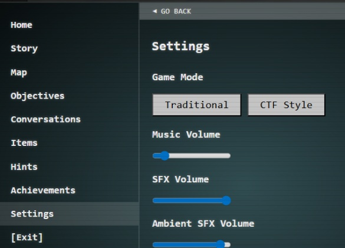
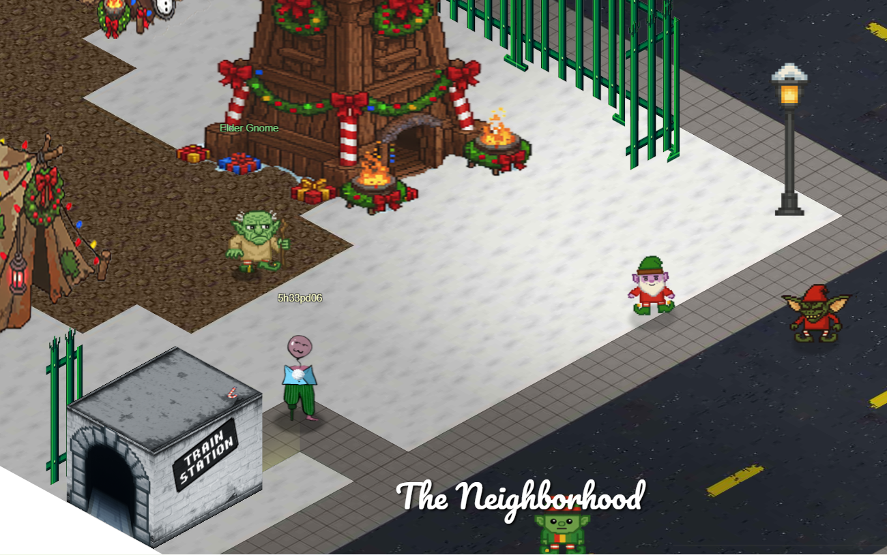
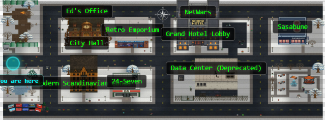

# 
HHC Orientation

Welcome back to the Holiday Hack Challenge!! This year we are not headed
to the North Pole, but we are going to The Neighborhood to save
Christmas!

We have our introductory terminal introduced to us by Lynn Schifano. All
we need to do is type in “answer” and press enter.

After completing this challenge, we are given the exit from the train
which takes us into the neighborhood.

We exit into The Neighborhood, and there are all sorts of Christmas
mayhem going on! We have gnomes running around speaking gnomish
nonsense, some sort of gnome encampment, and who knows what else!

We are given the ability to work through this year’s challenge either
through the Traditional mode, or CTF Style. The CTF style makes it fast
to work through challenges, but we’re here for the ambience, so we’ll
stick to Traditional mode.

Welcome to the Neighborhood!
