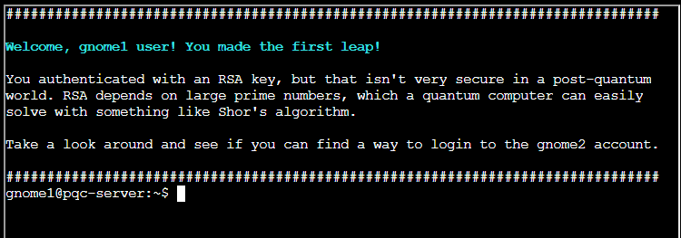

# Quantgnome Leap


We start out with a terminal with a riddle and talking about PQC.


We do a bit of initial enumeration, and we see that within the home directory, we have access to a standard id\_rsa and id\_rsa.pub pair. The first hurdle in any SSH challenge is file permissions. SSH clients will reject a private key if it is too "open." 

```
chmod 600 id\_rsa 
ssh -i ./id\_rsa gnome1@localhost
```



*Successfully authenticated as gnome1 via standard RSA.*

Inside the gnome1 home directory, we found keys for gnome2. These were **Ed25519** keys, which are currently the gold standard for SSH due to their speed and small key size.

To switch users, we’ll perform an SSH connection just like before. `ssh -i ./id\_ed25519 gnome2@localhost`


*Successfully authenticated as gnome2.*


We located a key pair named id\_mayo2. MAYO is known for its efficient, compact public keys and signatures, making it great for embedded systems, based on the [Oil & Vinegar](https://www.google.com/search?q=Oil+%26+Vinegar&oq=what+is+a+mayo+post+quantum+key&gs_lcrp=EgZjaHJvbWUyBggAEEUYOTIHCAEQIRigATIHCAIQIRigATIHCAMQIRigATIHCAQQIRigATIHCAUQIRigATIHCAYQIRirAjIHCAcQIRirAjIHCAgQIRiPAtIBCDU1ODJqMGo3qAIAsAIA&sourceid=chrome&ie=UTF-8&mstk=AUtExfBWhbcSxVx4Nb90pPD0GY4RZn-Am9CtjvrTuP2-5TS1XcSanaMbPa5n1BLcDwL6YsQsrhZ_6_u-YBh9P8PPj0jRRSJeLE_KLS7L6pylAaZ0EU8ADp8IYtx7UKAWQSKQQ9t87Pp62gRRfnY6LR-iO9IEZ51U0lHorWsRXu16zivpElc&csui=3&ved=2ahUKEwj2ndaF4duRAxWF5MkDHYDoI90QgK4QegQIARAD) (O&V) idea but "whipped up" for better performance and size, offering a secure way to sign data against future quantum computers. MAYO-2 has a larger public key (5,488 bytes) but a remarkably small signature size (only 180 bytes). This particular balance makes it an attractive candidate for specific use cases like DNS Security Extensions (DNSSEC)


*Successfully authenticated as gnome3.*

`ssh -i ./id\_mayo2 gnome3@localhost`


Here, things got interesting. We found a key named id\_ecdsa\_nistp256\_sphincssha2128fsimple.

This is a Hybrid Key provided by the Open Quantum Safe (OQS) project. It combines **ECDSA (P-256)**, which is a standard classical algorithm, and **SPHINCS+,** which is a stateless hash-based signature scheme resistant to quantum computer attacks.

For this to work, the SSH client and server must both be patched to support these OQS algorithms. Since we were on the challenge box, the local ssh binary supported it. `ssh -i ./id\_ecdsa\_nistp256\_sphincssha2128fsimple gnome4@localhost`


*Successfully authenticated as gnome4.*

The final key pair was id\_ecdsa\_nistp521\_mldsa87.


ML-DSA (Module-Lattice-Based Digital Signature Algorithm): Previously known as Dilithium, this is one of the primary algorithms selected by NIST for future standardization (FIPS 204).


*Successfully authenticated as admin.*

**Level 5 (87):** Indicates the highest security parameter set. 

`ssh -i ./id\_ecdsa\_nistp521\_mldsa87 admin@localhost`

**Clue:** "You now have access to a directory in the same location as the SSH daemon." We need to find where the sshd binary is running from. Standard system locations are usually /usr/sbin/sshd, but given the use of PQC keys, we should suspect a custom build.


We inspect the running processes: `ps -ef | grep sshd`

This reveals the custom installation path: **/opt/oqs-ssh/sbin/**.


`cat /opt/oqs-ssh/flag`

That finishes up Act II. Those were all pretty straightforward, but I’m guessing Act III will amp up the difficulty as we move into the 3, 4, and 5 snowflake challenges!

Let’s head back over to the apartment building and see what Thomas has in store for us.
