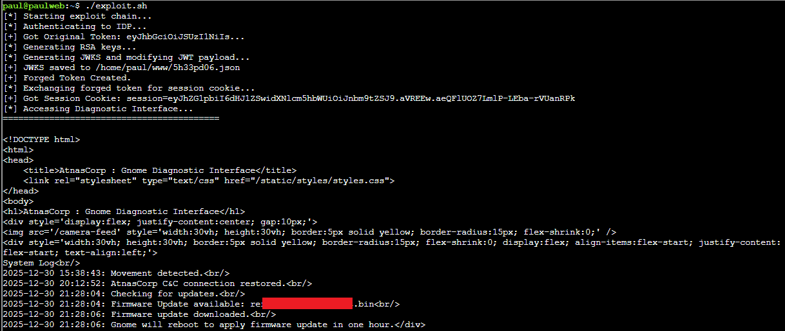

# Rogue Gnome Identity Provider

Talking with Paul, it seems he needs some help logging in to the web-server, getting to the protected diagnostic interface, and then finding the malicious firmware that has been downloaded. We have some creds to start with, but they are low level and we need to figure out how to elevate our privilege.

We’ve already learned some helpful curl commands from earlier, plus, Paul has left us a handy “notes” file with some good recon and notes, so this should be a walk in the park…

First, we need to authenticate and get a JWT: `curl -X POST --data-binary $'username=gnome&password=SittingOnAShelf&return\_uri=http%3A%2F%2Fgnome-48371.atnascorp%2Fauth' <http://idp.atnascorp/login>`

After authenticating with the provided credentials, we need to inspect the issued JWT. Paul left us jwt\_tool.py on the server, so we can use that to work with the JWT. A standard JWT consists of three parts: Header, Payload, and Signature.

There’s a critical detail in the Header which will help us get in! The jku (JSON Web Key Set URL) header parameter is an optional field that tells the server: *"To verify this token's signature, please download the public key from this URL."*

The vulnerability exists because the server trusts this header blindly. It does not validate that the jku URL belongs to a trusted domain (idp.atnascorp). This means we can point the jku field to a file we control, containing a public key we generate! The notes tell us that we can host files locally at <http://paulweb.neighborhood> (/home/paul/www).

Next, we need to modify that JWT to give us admin status. Since Paul was nice enough to leave us jwt\_tool.py, as well as detailed notes to walk through this challenge manually, that is one way we can use. However, to make this a bit more interesting, I decided to make a bash script to do what we need in one-shot. (The output shows each step along the way as well so we can see what data is being generated, modified, and sent, as well as the commands used to perform the actions.)

The steps followed by the exploit script are:

1.  **Authentication:** Log in as gnome to get a valid token format.

2.  **Key Generation:** Create a malicious RSA Keypair.

3.  **Hosting:** Save the Public Key (in JWKS format) to the internal web root (/home/paul/www/5h33pd06.json).

4.  **Forgery:** Create a new JWT with admin: true, point the jku header to our local JSON file (<http://paulweb.neighborhood/5h33pd06.json>), and sign it with our Private Key.

5.  **Execution:** Use the forged token to gain an Admin session. Send the token to <http://gnome-48371.atnascorp/auth>.

    1.  Server sees the jku header, fetches 5h33pd06.json from the internal paulweb domain, and validates our signature.

    2.  Server grants a session cookie.

    3.  Script uses the cookie to dump the diagnostic-interface.

Next up on our quest is to stop by the hotel and see what mysteries await us!
